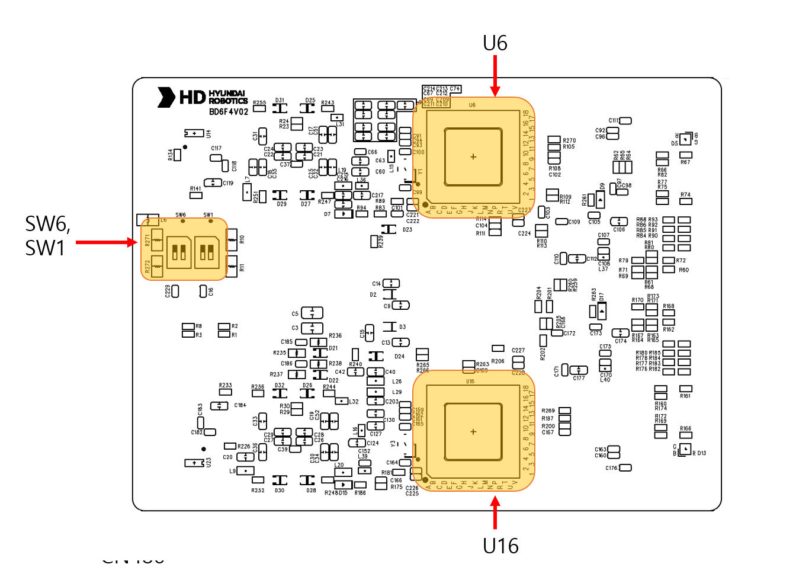
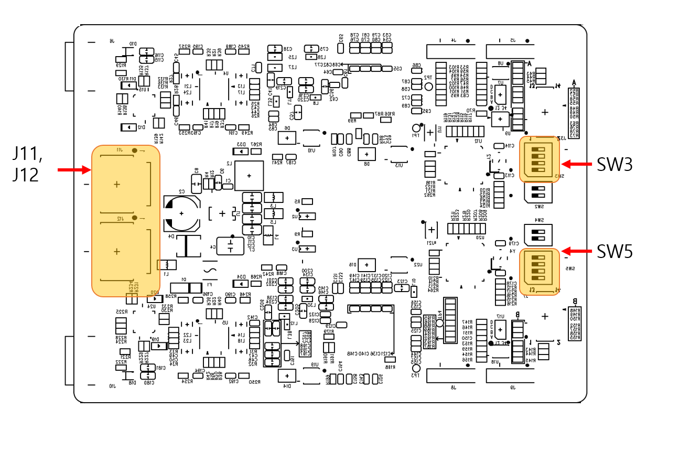

# 4.3.2.1 연결 및 표시

BD6F4 (Sensor Unit) 개요

BD6F4 센서 유닛은 물체 탐지를 위한 mmWave 레이다 센서이다.
로봇 내부에는 최대 4개까지 설치할 수 있으며, 필요 시 외장형 센서 모듈을 추가로 2개까지 확장 가능하다.

커넥터 구성

그림 xx Sensor Unit BD6F4 Front-side

|   **커넥터**   | 　　　　　　**용도**                                                        |              ** 연결 장치**             |
| :---------: | ------------------------------------------------------------------- | :-----------------------------------: |
|    SW1   | A Channel CAN terminal 저항(120ohm)   |           -       |
|   SW6  | B Channel CAN terminal 저항(120ohm)     |           -            |
|    U6   | A Channel mmWave MCU          |          -         |
|    U16    | B Channel mmWave MCU        |          -        |

그림 xx Sensor Unit BD6F4 Back-side

|   **커넥터**   | 　　　　　　**용도**                                                        |              ** 연결 장치**             |
| :---------: | ------------------------------------------------------------------- | :-----------------------------------: |
|   J11  | 전원 커넥터(DC24V) 및 CAN A, CAN B Channel                            |              BD6F3(Control Unit)          |
|    J12   | 전원 커넥터(DC24V) 및 CAN A, CAN B Channel                                |           
외장형 레이다 사용시 : BD6F4 (Sensor Unit)

미사용시 연결 X
       |
|    SW3   | A Channel CAN ID |           -         |
|    SW5   | B Channel CAN ID |           -         |

