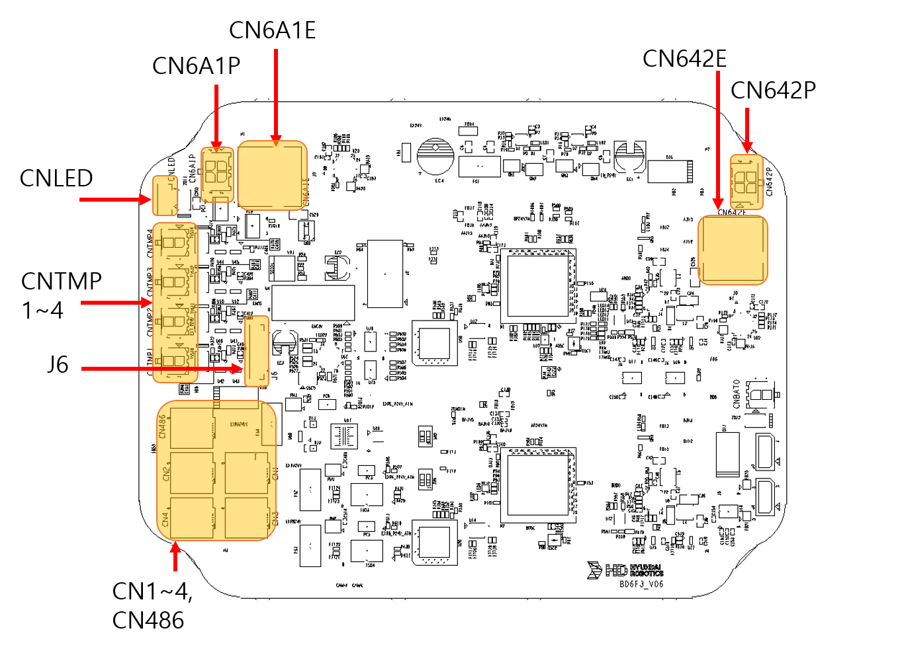

# 4.3.2.1 연결 및 표시

컨트롤 보드 개요

컨트롤 보드는 2차 엔코더, 센서 유닛, 제어기와의 통신을 담당하는 핵심 모듈이다. 외부 장치와의 안정적인 데이터 송수신을 위해 다양한 접속 장치를 제공한다.

접속 장치 구성

2차 엔코더 포트 : 2차 엔코더 신호 입력 및 피드백 전송

센서 유닛 인터페이스 : 레이더 센서 데이터 수집 및 모니터링

제어기 통신 포트 : 상위 제어기와의 실시간 EtherCAT 통신 지원 

컨트롤보드 이미지 삽입하기.

|   **커넥터**   | 　　　　　　**용도**                                                        |              ** 연결 장치**             |
| :---------: | ------------------------------------------------------------------- | :-----------------------------------: |
|   CN6A1P  | TOOL BOARD 연결 전원 입력 DC24V                            |              TOOL BOARD            |
|    CN6A1E   | TOOL BOARD EtherCAT 통신용 커넥터                                 |           TOOL BOARD       |
|    CNLED   | 1축 베이스 기구부 LED 커넥터 |           1축 베이스 기구부           |
|     CNTMP1-4    | 1-4축 감속기 온도센서용 커넥터 포트                                                           |           로봇 케이블 연결 단자(CNM)           |
|     J6     | 2차엔코더용 커넥터                    |          각 축 2차엔코더         |
|    CN1-4,CN486    | 센서유닛용 전원 및 통신 케이블 (DC24V)                                             |              BD6F4(SENSOR UNIT)             |
|    CN642E    | 상위 제어기와의 EtherCAT 통신용                                             |           BD642           |
|    CN642P    | 상위 제어기로부터의 전원 공급 (DC 24V)                                        |             BD642             |
